# Segmentation results

The postprocessing included: removal of small objects, removal of small holes, and binary closing. This helped eliminate segmentation artifacts and holes, smooth out corners, and obtain cleaner masks, leading to an improvement in IoU and Dice Coefficient.

## I. UNet

| Parameter |  |
|------------|---|
batch_size | 8
epochs | 20
learning_rate | 0.001
model | UNet
num_blocks | 3
optimizer | Adam
scheduler | CosineAnnealingLR
threshold | 0.0
with_postprocess | True

### 1. Cross-Entropy

- train-set masks
  
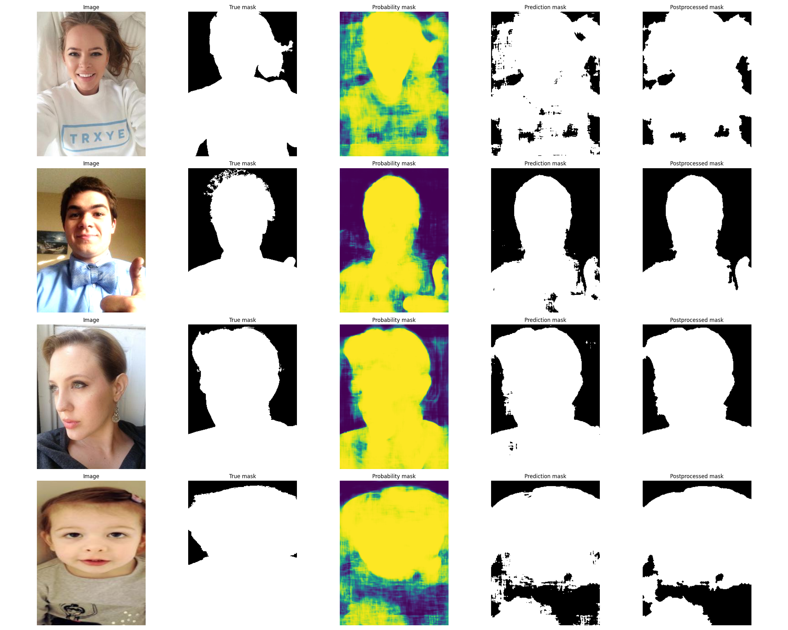

- test-set masks

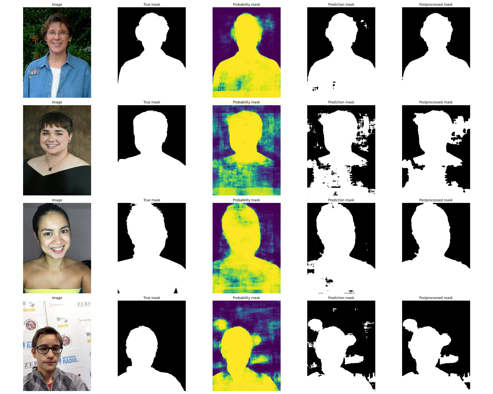
| Split | Metric | Before | After | Improvement |
|-------|--------|-------:|------:|------------:|
| Train | Dice | 0.95031 | 0.95421 | +0.00390 |
| Train | IoU  | 0.91174 | 0.91887 | +0.00713 |
| Test  | Dice | 0.90954 | 0.91489 | +0.00535 |
| Test  | IoU  | 0.84114 | 0.85031 | +0.00917 |

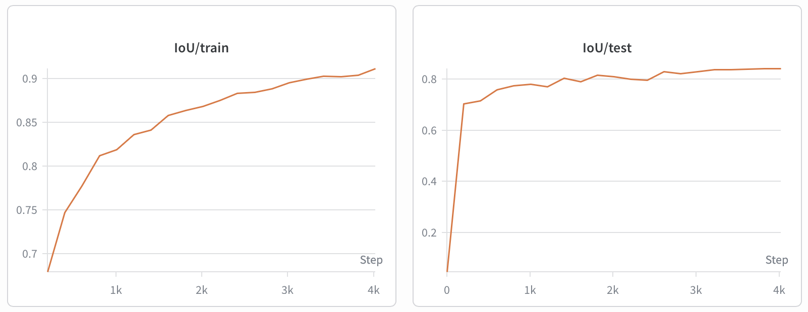

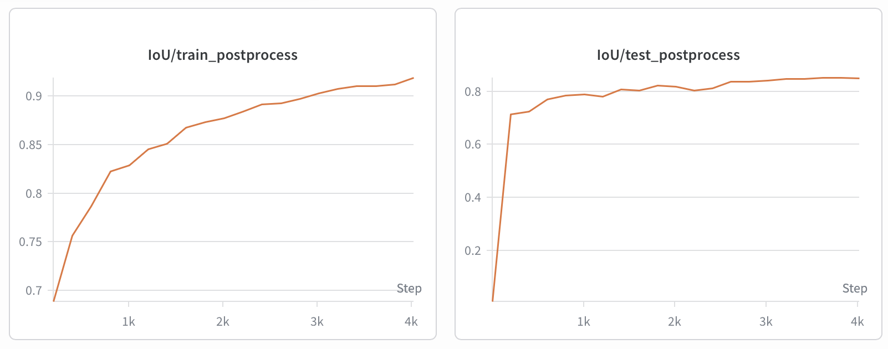

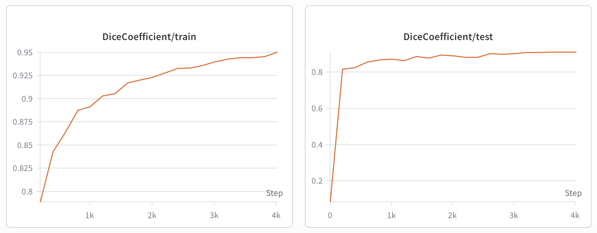

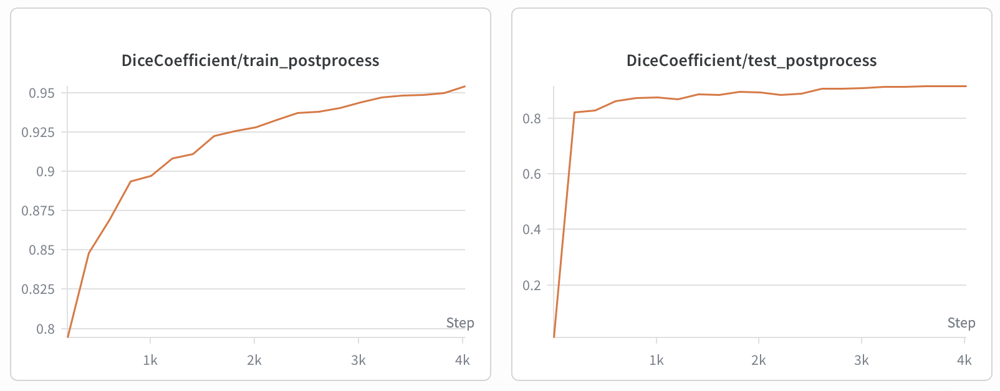

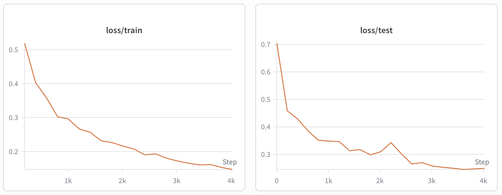

### 2. Dice Loss
- train-set masks
  
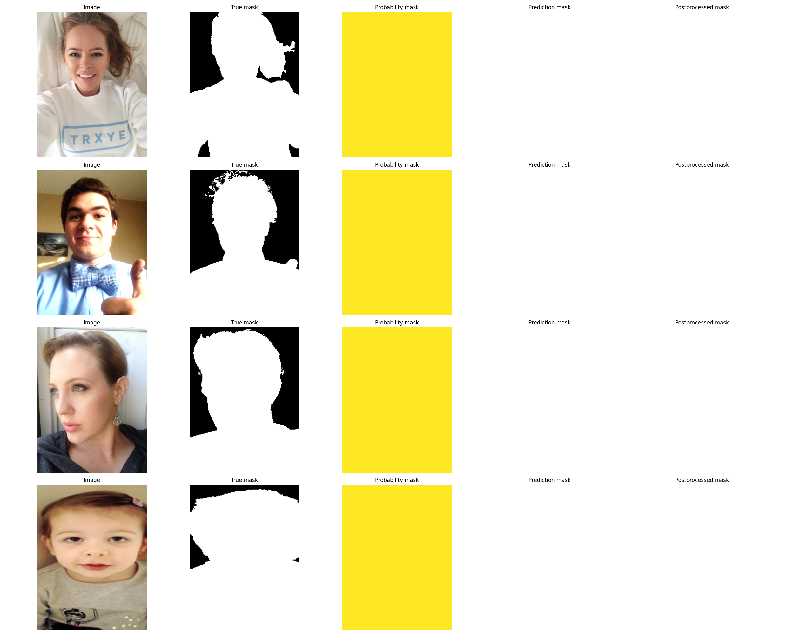

- test-set masks

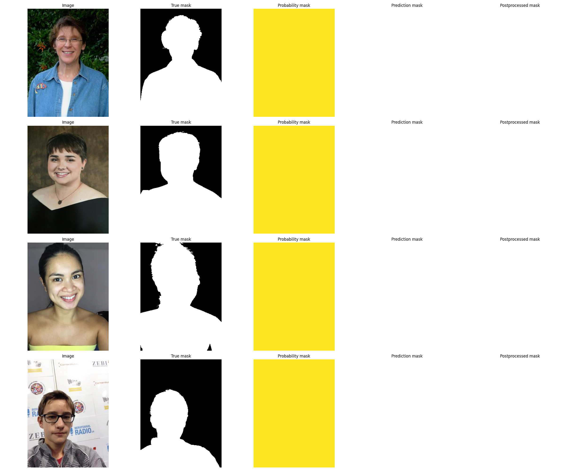
| Split | Metric | Before | After | Improvement |
|-------|--------|-------:|------:|------------:|
| Train | Dice | 0.76426 | 0.76426 | +0.00000 |
| Train | IoU  | 0.64118 | 0.64118 | +0.00000 |
| Test  | Dice | 0.73991 | 0.73991 | +0.00000 |
| Test  | IoU  | 0.60398 | 0.60398 | +0.00000 |
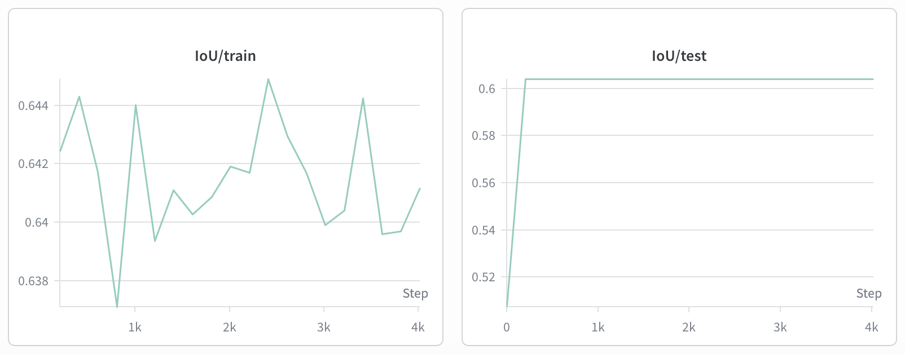

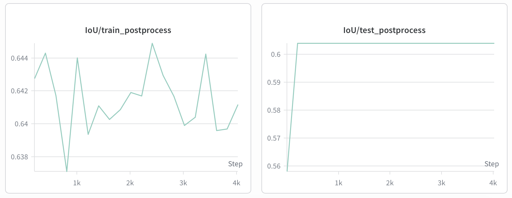

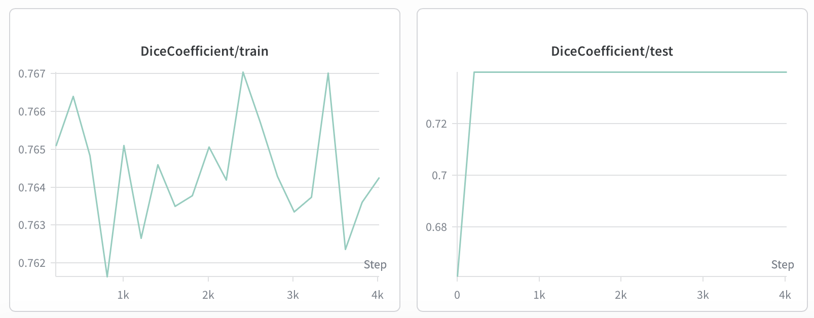

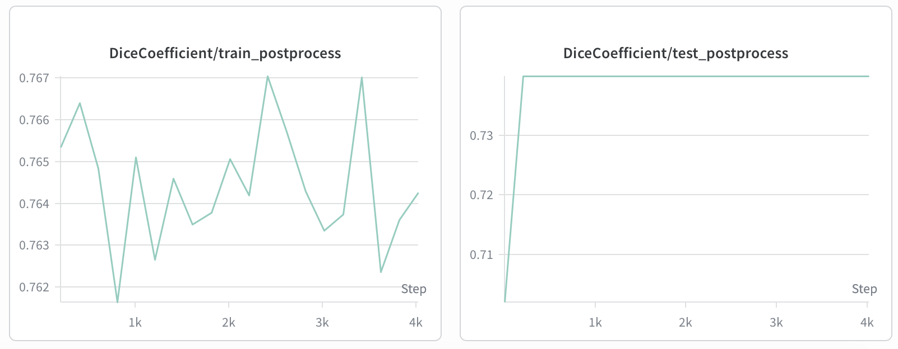

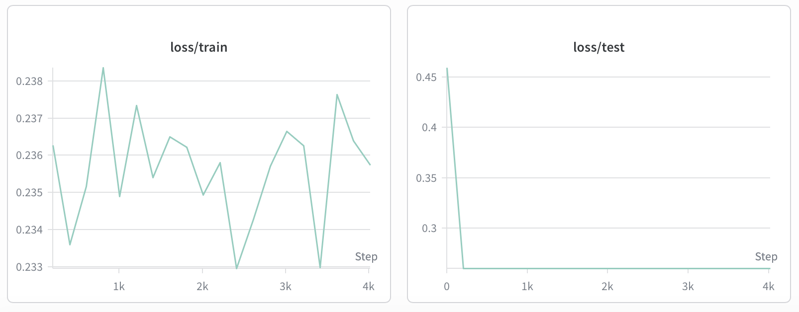
  
### 3. Cross-Entropy + Dice Loss

- train-set masks

- test-set masks

### 4. 0.3 * Cross-Entropy + 0.7 * Dice Loss

- train-set masks
  

- test-set masks

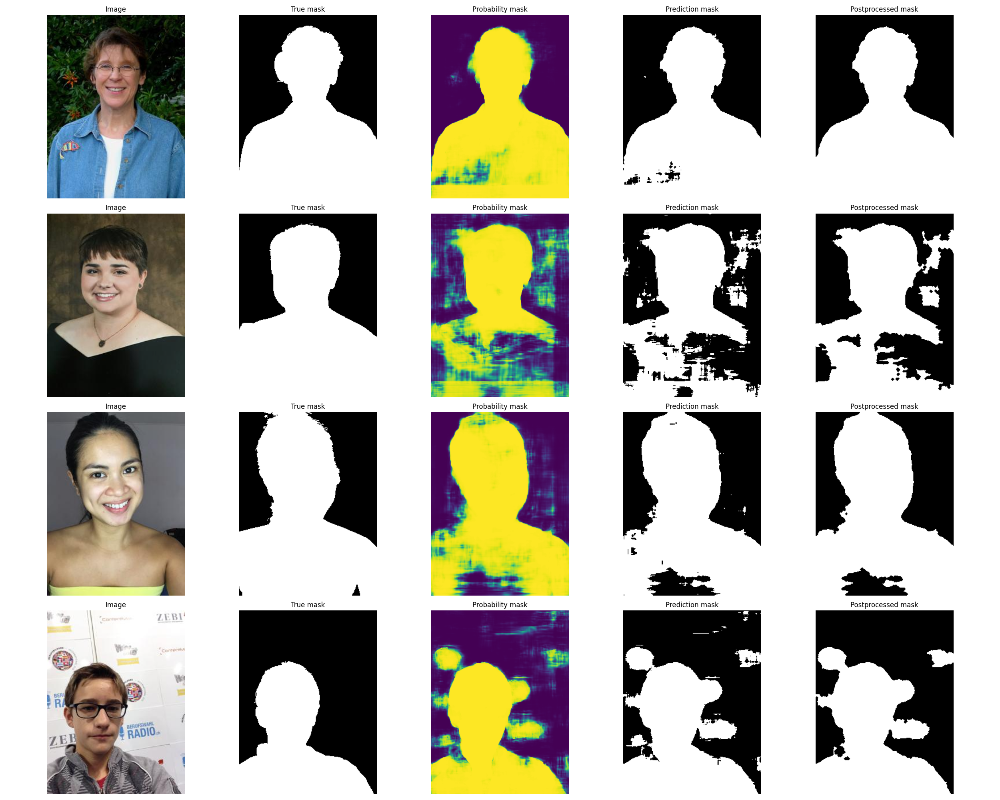

| Split | Metric | Before | After | Improvement |
|-------|--------|-------:|------:|------------:|
| Train | Dice | 0.94652 | 0.95060 | +0.00408 |
| Train | IoU  | 0.90562 | 0.91299 | +0.00737 |
| Test  | Dice | 0.90778 | 0.91319 | +0.00541 |
| Test  | IoU  | 0.83819 | 0.84733 | +0.00914 |

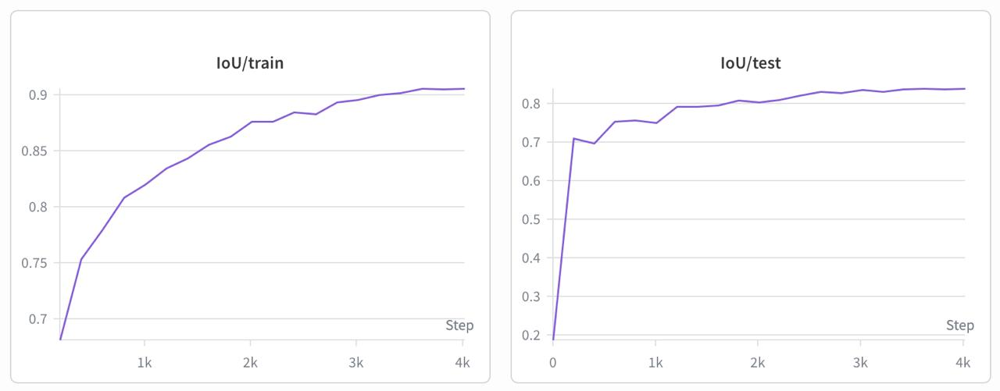

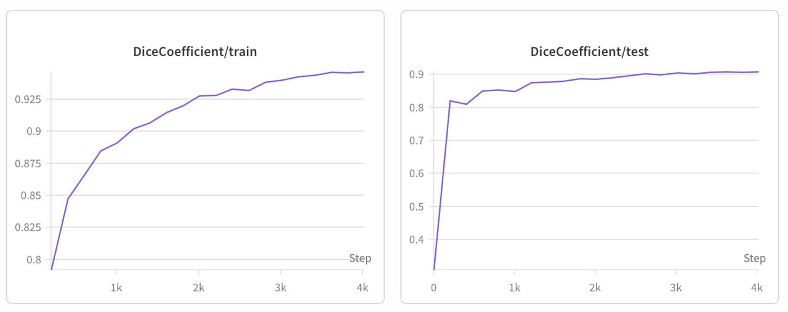

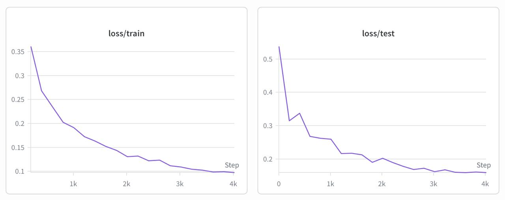

### 5. 0.7 * Cross-Entropy + 0.3 * Dice Loss

- train-set masks

- test-set masks

## II. LinkNet

| Parameter |  |
|------------|---|
batch_size | 8
epochs | 20
learning_rate | 0.001
model | LinkNet
num_blocks | 3
optimizer | Adam
scheduler | CosineAnnealingLR
threshold | 0.0
with_postprocess | True

### 1. Cross-Entropy

### 2. Dice Loss

### 3. Cross-Entropy + Dice Loss

### 4. 0.3 * Cross-Entropy + 0.7 * Dice Loss

### 5. 0.7 * Cross-Entropy + 0.3 * Dice Loss
