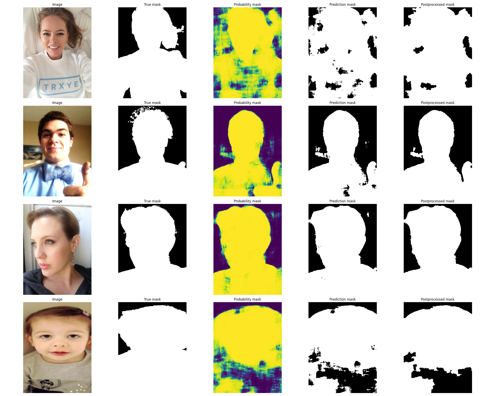
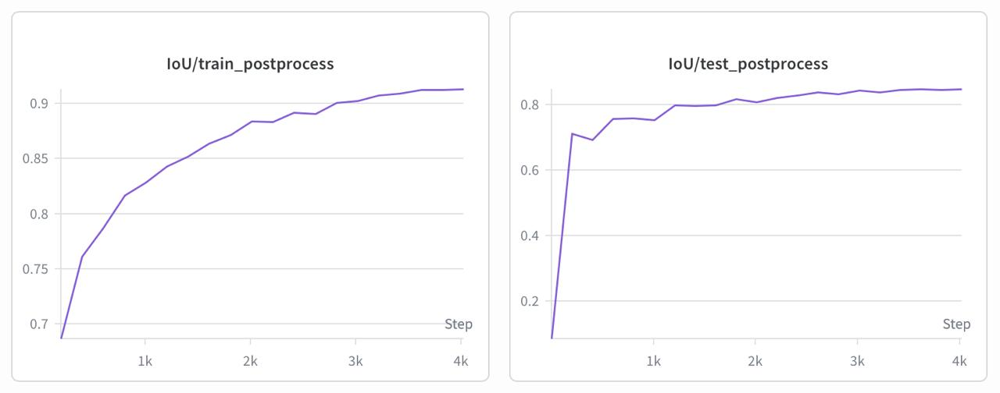
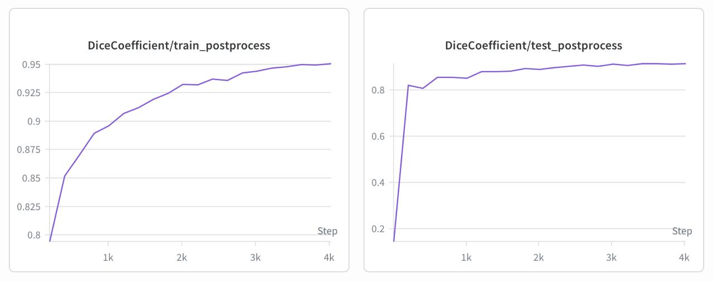

# Segmentation results

## I. UNet

### 1. Cross-Entropy

### 2. Dice Loss

### 3. Cross-Entropy + Dice Loss

### 4. 0.3 * Cross-Entropy + 0.7 * Dice Loss

### 5. 0.7 * Cross-Entropy + 0.3 * Dice Loss

## II. LinkNet

### 1. Cross-Entropy

### 2. Dice Loss

### 3. Cross-Entropy + Dice Loss

### 4. 0.3 * Cross-Entropy + 0.7 * Dice Loss

### 5. 0.7 * Cross-Entropy + 0.3 * Dice Loss

## III. Postprocessing

| Parameter |  |
|------------|---|
batch_size | 8
criterion | BCEWithLogitsLoss
epochs | 20
learning_rate | 0.001
model | UNet
num_blocks | 3
optimizer | Adam
scheduler | CosineAnnealingLR
threshold | 0.0
with_postprocess | True

| Split | Metric | Before | After | Improvement |
|-------|--------|-------:|------:|------------:|
| Train | Dice | 0.94652 | 0.95060 | +0.00408 |
| Train | IoU  | 0.90562 | 0.91299 | +0.00737 |
| Test  | Dice | 0.90778 | 0.91319 | +0.00541 |
| Test  | IoU  | 0.83819 | 0.84733 | +0.00914 |

